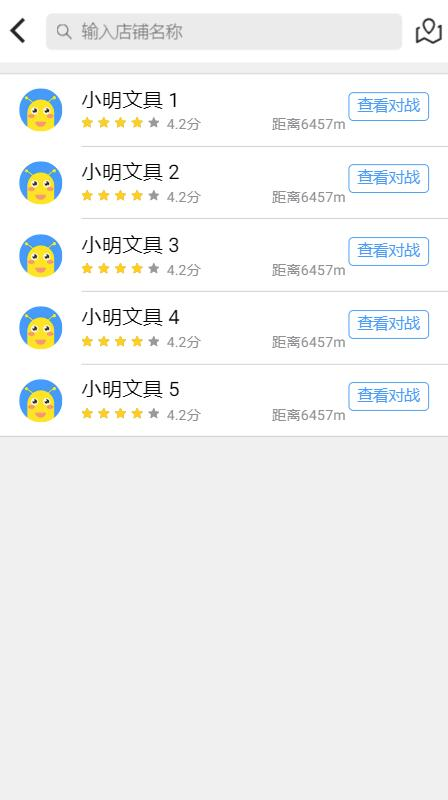
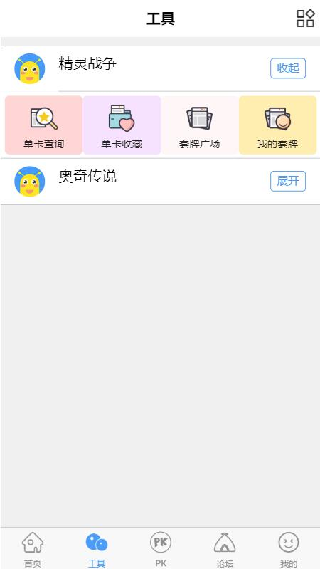
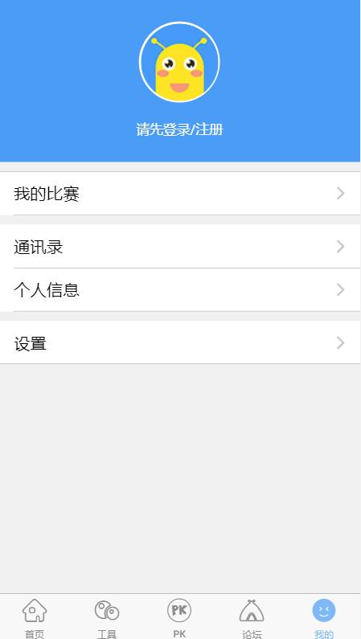
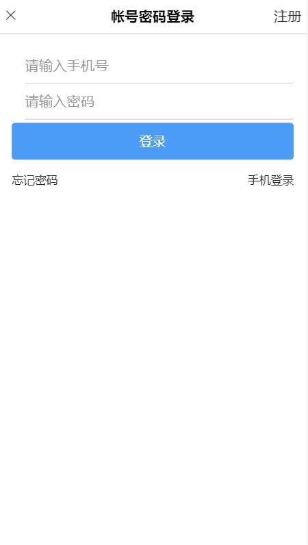

## 一个基于Ionic3.x cordova的移动APP demo

### 前端技术:

Angular4.x + ionic3.x + cordova

### 项目运行:

```bash

# 安装ionic和cordova
npm install -g cordova ionic

# 安装项目依赖
npm install

# 在浏览器中启动项目
npm run serve

# 添加android平台
ionic cordova platform add android

# usb连接安卓手机运行
npm run dev

```


项目名：[A Ionic3.x project]，Ionic3.x的移动APP demo。


## 1. 如何运行

> node版本 `[8.0.0]`

### 1.1 开发环境配置

```sh

# 安装ionic和cordova
npm install -g cordova ionic

# 安装项目依赖
npm install


```

### 1.2 开发过程

#### 1.2.1 命令

```sh

# 在浏览器中启动项目
ionic serve

# 添加android平台
ionic cordova platform add android

# usb连接安卓手机运行
ionic cordova run android

```


### 1.3 发布

```sh

# 打包
npm run build

```

## 2. 业务介绍

### 2.1 小程序业务入口

入口地址为 `src/app/app.module.ts`

目录结构

    ionic-conference-app/
	|
	|-- resources/
	|
	|-- src/
	|    |-- app/
	|    |    ├── app.component.ts
	|    |    └── app.module.ts
	|    |    └── app.template.html
	|    |    └── main.ts
	|    |
	|    ├── assets/
	|    |    ├── fonts/
	|    |    |
	|    |    ├── icon/
	|    |    |
	|    |    └── images/
	|    |
	|    |-- components/                     * 组件
	|    |
	|    |-- pages/                          * 页面
	|    |
	│    ├── services/                       * angular主题
	|    |     └── httpService.ts.scss       * http请求封装
	|    |
	│    ├── theme/                          * ionic主题配置
	|    |     └── variables.scss            * 主题 Sass 变量
	|    |
	|    └── index.html
	|
	├── .editorconfig                       * 代码风格配置文件
	├── .gitignore                          * git忽略目录
	├── LICENSE                             
	├── README.md                           
	├── config.xml                          * Cordova配置文件
	├── ionic.config.json                   * Ionic配置文件
	├── package.json                        * 依赖配置文件
	├── tsconfig.json                       * TypeScript配置选项
	└── tslint.json                         * 定义 TypeScript 规则

### 2.2 已完成功能

- 底部tabbar的跳转
- 组件间的通信
- 二级页面的跳转
- http请求通信
- app图标以及启动页的配置










## 3. 其他

ionic开发文档地址

> https://ionicframework.com/docs/


