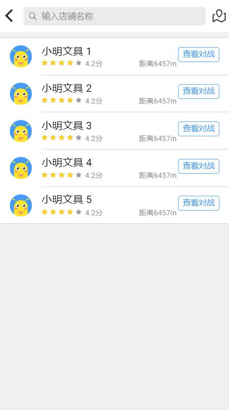
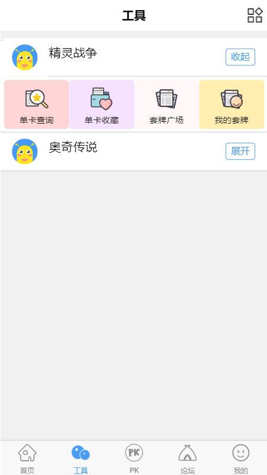
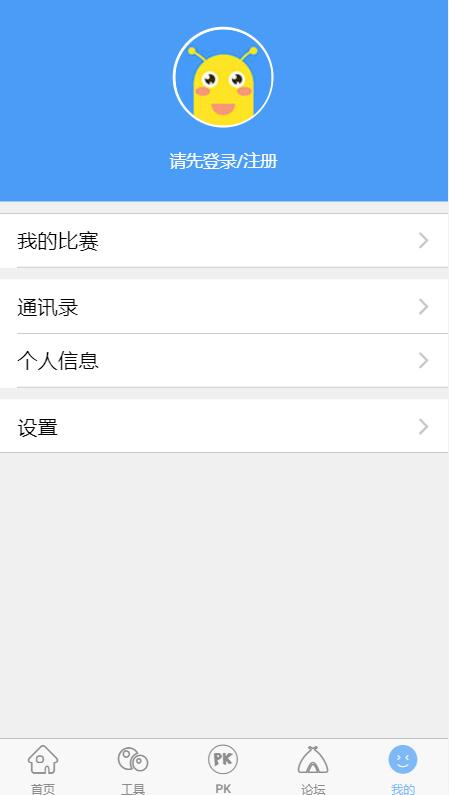

English | [简体中文](./README.md)

## A mobile app demo based on Ionic3.x cordova

In case of poor network, please move to [Domestic Mirror Acceleration Node] (https://gitee.com/easytuan/ionic-cordova-demo)

### Front-end technology:

Angular4.x + ionic3.x + cordova

### Project Run:

```bash

Git clone git@github.com:EasyTuan/ionic-cordova-demo.git

# Domestic Mirror Acceleration Node: git@gitee.com:easytuan/ionic-cordova-demo.git

# global installation of ionic and cordova
Npm install -g cordova ionic

#Install project dependencies
Npm install

#Start the project in the browser
Npm run serve

# Add android platform
Ionic cordova platform add android

# usbConnect Android phone to run
Npm run dev

```

Project Name: [A Ionic3.x project], Ionic3.x mobile app demo.

## 1. How to run

> node version `[8.0.0]`

### 1.1 Development Environment Configuration

```sh

# Install ionic and cordova
Npm install -g cordova ionic

#Install project dependencies
Npm install

```

### 1.2 Development Process

#### 1.2.1 Command

```sh

#Start the project in the browser
Ionic serve

# Add android platform
Ionic cordova platform add android

# usbConnect Android phone to run
Ionic cordova run android

```

### 1.3 Release

```sh

# Bale
Npm run build

```

## 2. Business Introduction

### 2.1 Small program business entrance

The entry address is `src/app/app.module.ts`

Directory Structure

    ionic-conference-app/
	|
	|-- resources/
	|
	|-- src/
	|    |-- app/
	|    |    ├── app.component.ts
	|    |    └── app.module.ts
	|    |    └── app.template.html
	|    |    └── main.ts
	|    |
	|    ├── assets/
	|    |    ├── fonts/
	|    |    |
	|    |    ├── icon/
	|    |    |
	|    |    └── images/
	|    |
	|    |-- components/
	|    |
	|    |-- pages/
	|    |
	│    ├── services/
	|    |     └── httpService.ts
	|    |
	│    ├── theme/
	|    |     └── variables.scss
	|    |
	|    └── index.html
	|
	├── .editorconfig
	├── .gitignore
	├── LICENSE                             
	├── README.md                           
	├── config.xml
	├── ionic.config.json
	├── package.json
	├── tsconfig.json
	└── tslint.json
	
### 2.2 Completed function

- Bottom tabbar jump
- Communication between components
- Jump of the secondary page
- http request communication
- app icon and configuration of the launch page

## Partial screenshot show

### Home Show && Shop List

 

### Tools && My

 

### log in


## 3. Others

Ionic development document address

> https://ionicframework.com/docs/


## 4. Links

[Project full version (based on mui)] (https://github.com/EasyTuan/mui-kidApp)

# Donation

If you are helpful, welcome to reward

 

# License

[MIT](LICENSE)